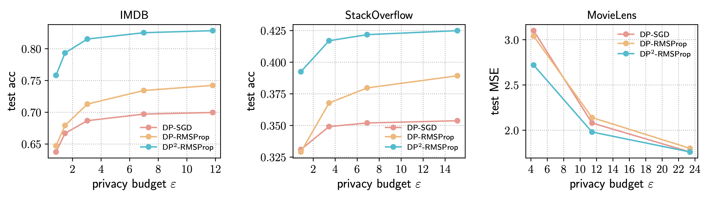
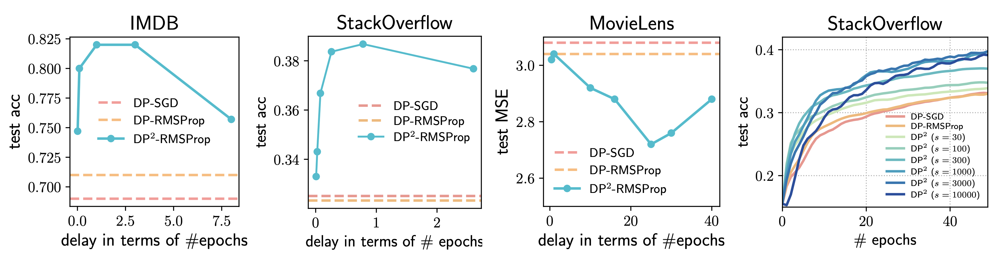

# $\text{DP}^2$: Differentially Private Adaptive Optimization with Delayed Preconditioners

Official JAX/Haiku implementation of the paper "Differentially Private Adaptive Optimization with Delayed Preconditioners".

[[PDF](https://arxiv.org/pdf/2212.00309)][[arXiv](https://arxiv.org/abs/2212.00309)]

## Dependencies

* Python 3.9 (older versions may work but not tested)
* Python packages specified in `requirements.txt`.

## Result Highlights

$\text{DP}^2$ can achieve better privacy-utility tradeoffs compared to vanilla private optimizers:



We can also visualize the effects of the preconditioner delays:



## Directory Structure

* `main.py`: the main driver script, which takes args and runs experiments
* `data/`: datasets
* `trainers/`: implementations of DP^2 and other methods
* `trainers/trainer_base`: logic for loading datasets, training, and evaluating models
* `plotting/`: example code for plotting results
* `privacy_analysis/`: privacy accounting
* `data_utils.py`: data loading and preprocessing
* `jax_utils.py`: helper functions for JAX
* `model_utils.py`: model definitions in Haiku
* `parallel_utils.py`: helper functions for parallel training for hyperparameter grid search
* `utils.py`: other helper functions

## Datasets

**Download**:
* IMDB and MovieLens: included in `data/` folder
* StackOverflow:

```bash
wget 'https://www.dropbox.com/s/yell7tasiko7zvk/so_tag.zip?dl=1' -O data/so_tag.zip
```

**Preparation**:

```bash
unzip data/imdb.zip -d data/imdb  # WARNING: expands to ~4GB
unzip data/so_tag.zip -d data/stackoverflow_tag  # WARNING: expands into ~28GB
```

The `data/` folder structure should look like:

```
- data/
  - imdb/
    - x_train.npy
    - x_test.npy
      ...
  - stackoverflow_tag/
    - x_train.npy
      ...
  - movielens_100k/
    - u.data
```

## Environment setup

We recommend setting up the environment with `conda` :

```bash
conda create -n dp2 python=3.9
conda activate dp2
pip install -r requirements.txt
```

**NOTE**: we focus on setting the environment for **training on CPUs**, which is sufficient for quickstarting with the `imdb` dataset. For other datasets, we'll need to setup a CUDA runtime with the `jax` / `jaxlib` dependencies installed according to your local setup; please see the [JAX installation guide](https://github.com/google/jax#pip-installation-gpu-cuda) for more details.

## Training

Template command for training:

```bash
python3 main.py \
    --method [one of `trainers/` filenames] \
    --dataset [one of imdb/so_tag/movielens] \
    --batch_size 64 --epochs 100 --lr [...] \
    --clip1 [...] --sigma [...] --delta [...] \
    [other flags in `main.py`]
```

Example of running SGD on IMDB (non-private):

```bash
python3 main.py --method sgd --dataset imdb --batch_size 64 --epochs 100 --lr 5.0
```

See the paper appendix for hyperparameters.

## Example: Reproducing IMDB results in Fig. 4 (left)

1. **Run DP-SGD on IMDB**:

```bash
python3 main.py --dataset imdb --batch_size 64 --epochs 100 \
    --method dp_sgd --sigma 1.0 \
    --lr 5.0 --clip1 0.5 \
    -o logs/imdb/dp_sgd_nm1.0
```

2. **Run DP-RMSProp on IMDB**:

```bash
# `epsilon` is the optimizer adaptivity, not the privacy parameter
python3 main.py --dataset imdb --batch_size 64 --epochs 100 \
    --method dp_rmsprop --sigma 1.0 \
    --lr 0.3 --clip1 0.1 --epsilon 1e-3 \
    -o logs/imdb/dp_rmsprop_nm1.0
```

3. **Run DP^2-RMSProp on IMDB** (reproduces Fig. 4 in the paper, without repeats):

```bash
# `epsilon` is the optimizer adaptivity, not the privacy parameter
python3 main.py --dataset imdb --batch_size 64 --epochs 100 \
    --method dp2_rmsprop --sigma 1.0 \
    --lr 0.1 --lr2 3.0 --clip1 0.5 --clip2 5.0 \
    --epsilon 1e-7 --interval 195 \
    -o logs/imdb/dp2_rmsprop_nm1.0
```

4. **Plot the results**:

```bash
python3 plotting/plot.py
```

(Add `--repeat 5` to experiment commands to repeat the experiments with 5 random seeds; change `runtype` to `'rep'` in `plotting/plot.py` for plotting mean and std.)

## Troubleshooting

Please feel free to contact Ken Liu <<kzliu@cmu.edu>> and Tian Li <<tianli@cmu.edu>> if you run into issues when running the code.

## Citation

Please use the following BibTeX entry:

```bibtex
@misc{li2022differentially,
    title={Differentially Private Adaptive Optimization with Delayed Preconditioners},
    author={Tian Li and Manzil Zaheer and Ken Ziyu Liu and Sashank J. Reddi and H. Brendan McMahan and Virginia Smith},
    year={2022},
    eprint={2212.00309},
    archivePrefix={arXiv},
    primaryClass={cs.LG}
}
```
